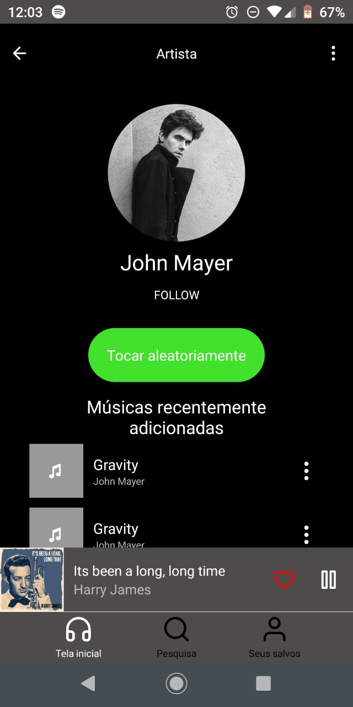
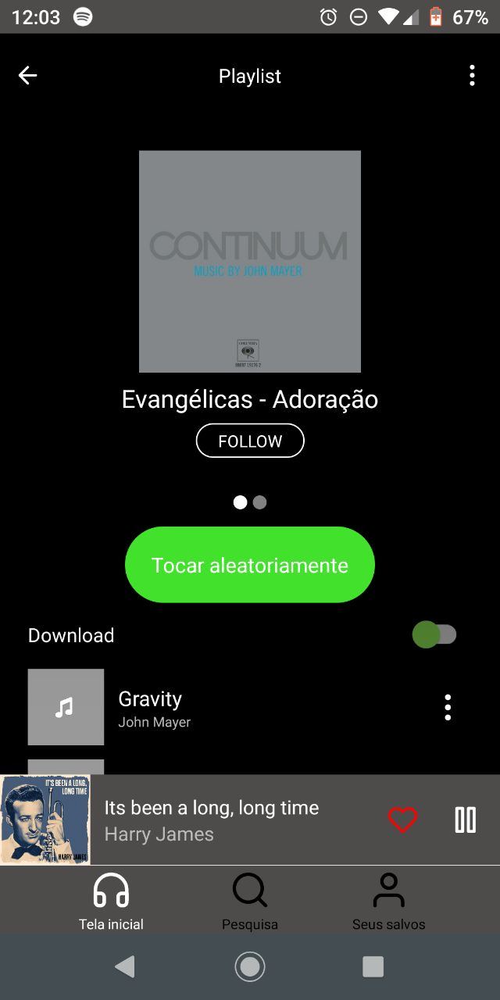
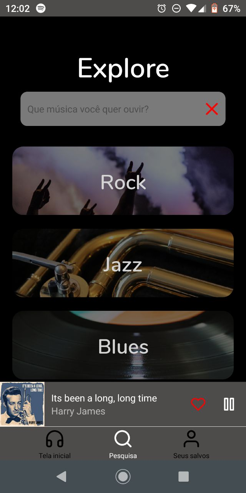

<h1 align="center">
  music-app
</h1>

<p align="center">
  
  
  
</p>

<p align="center">
 <a href="#objetivo">Objetivo</a> •
 <a href="#layout">Layout</a> • 
 <a href="#features">Features</a> • 
 <a href="#requisitos">Requisitos</a> • 
 <a href="#rodando-o-app">Rodando o app</a> • 
 <a href="#tecnologias">Tecnologias</a> • 
 <a href="#autor">Autor</a>
</p>

Projeto desenvolvido no [Figma](https://www.figma.com/file/SyrEVI36hw0MtH06IUeseN/music-app?node-id=5%3A2).

### Objetivo

<p align="center"> Este projeto foi feito com o objetivo de criar algo concreto com react-native + expo. É uma Aplicação Front-End genérica para ouvir músicas.</p>

### Layout

<p align="center">
  <h1 style="display: flex; flex-wrap: wrap;">
    
    
    
    

  </h1>
</p>

### Features

- [x] Layout de todas as páginas principais
- [x] Configuração redux
- [x] Roteamento de telas

### Requisitos

Antes de começar, você vai precisar ter instalado em sua máquina as seguintes ferramentas:
[Git](https://git-scm.com), [NPM](https://nodejs.org/en/) ou [Yarn](https://yarnpkg.com/) e o [Expo CLI](https://docs.expo.dev/workflow/expo-cli/). 
Além disto é bom ter um editor para trabalhar com o código como [VSCode](https://code.visualstudio.com/).


### Rodando o app

```bash
# Clone este repositório
$ git clone https://github.com/Daniel-Alencar/mobile-of-music-app

# Acesse a pasta do projeto no terminal/cmd
$ cd music-app

# Instale as dependências
$ yarn install

# Execute a aplicação
$ yarn start
```

### Tecnologias

As seguintes ferramentas foram usadas na construção do projeto:

- [Expo](https://expo.dev/)
- [React Native](https://reactnative.dev/)
- [TypeScript](https://www.typescriptlang.org/)

### Autor


Feito por Daniel Alencar! 
Entre em contato!

[](https://www.instagram.com/daniel_alencar_/) [](https://www.linkedin.com/in/Daniel746/) [](mailto:danielalencar746@gmail.com)
